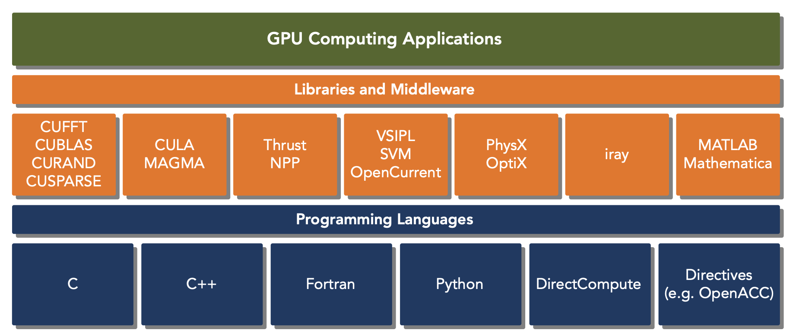
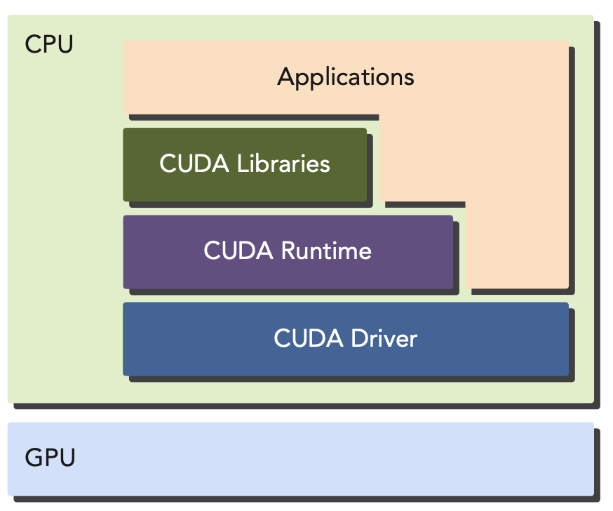
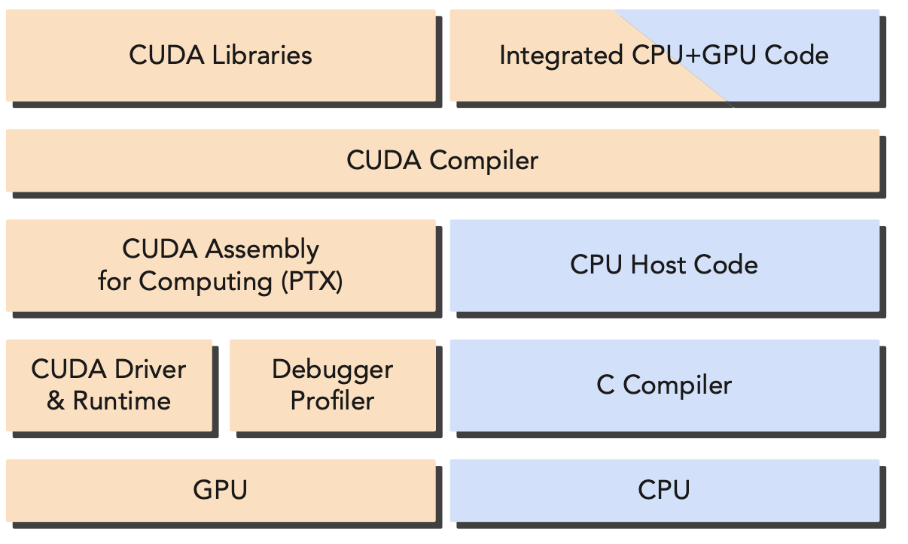
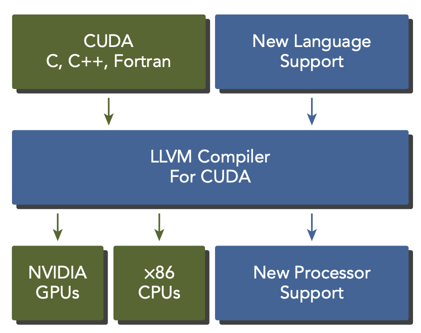

# CUDA: A Platform for Heterogeneous Computing


- CUDA C is an extension of standard ANSI C with a handful of language extensions to enable heterogeneous programming, and also straightforward APIs to manage devices, memory, and other tasks. CUDA is also a scalable programming model that enables programs to transparently scale their parallelism to GPUs with varying numbers of cores, while maintaining a shallow learning curve for programmers familiar with the C programming language.
- CUDA provides two APIs for programming:
    - **CUDA Driver API**: a low-level API that gives you explicit control over the GPU and is suitable for implementing libraries and frameworks.
    - **CUDA Runtime API**: a higher-level API that is easier to use and is suitable for most applications.
    

- A CUDA program consists of two parts:
    - **Host code**: runs on the CPU and controls the GPU.
    - **Device code**: runs on the GPU and performs the computation.
- NVIDIA's CUDA nvcc compiler compiles the host code and device code separately. The host code is compiled with C compilers while the device code, extended with keywords for labeling data-parallel functuons, called kernels, is compiled with nvcc.

- The CUDA nvcc compiler is based on the widely used LLVM open source compiler infrastructure.


## Hello World from GPU

- Create a source file named `hello.cu` with the following code:
    ```c
    #include <stdio.h>
    int main(void) {
        printf("Hello World from CPU \n");
        return 0;
    }
    ```
    - Compile the code with the following command:
    ```bash
    $ nvcc hello.cu -o hello
    ```
    - Run the executable:
    ```bash
    $ ./hello
    ```
    - The output should be:
    ```
    Hello World from CPU
    ```

- Now, let's modify the code to run on the GPU:
    ```c
    #include <stdio.h>
    __global__ void helloFromGPU(void) {
        printf("Hello World from GPU \n");
    }
    int main(void) {
        printf("Hello World from CPU \n");
        helloFromGPU<<<1, 5>>>();
        cudaDeviceReset();
        return 0;
    }
    ```
    - Compile the code with the following command:
    ```bash
    $ nvcc hello.cu -o hello
    ```
    - Run the executable:
    ```bash
    $ ./hello
    ```
    - The output should be:
    ```
    Hello World from CPU
    Hello World from GPU
    Hello World from GPU
    Hello World from GPU
    Hello World from GPU
    Hello World from GPU
    ```

- The `__global__` keyword is a CUDA C keyword that indicates a function that runs on the GPU and is called from the host code. The `<<<1, 5>>>` syntax is a CUDA C syntax that launches the `helloFromGPU` kernel with one block and five threads. The `cudaDeviceReset()` function is a CUDA C function that resets the device and releases all resources associated with the current device in the current process.

- CUDA Program Stucture
    - Allocate GPU memory
    - Copy data from the host to the device
    - Invoke the CUDA kernel to perform the computation
    - Copy the data back from the device to the host
    - Destroy the GPU memory

- CUDA exposes you to the concepts of both memory hierachy and thread hierachy, extending your ability to control thread execution and scheduling to a greater degree than traditional CPU programming which is limited to the CPU's cache and thread scheduling.
    - Memory hierachy: global memory, shared memory, constant memory, and texture memory.
    - Thread hierachy: grid, block, and thread.

- When writing a program in CUDA C, you actually just write a piece of serial code to be called by only one thread. The GPU takes this kernel and makes it parallel by launching thousands of threads, all performing that same computation.
- At its core are three key abstractions: a hierarchy of thread groups, a hierarchy of memory groups, and barrier synchronization, which are exposed to you as a minimal set of language extensions.

- CUDA DEVELOPMENT ENVIRONMENT: NVIDIA provides a comprehensive development environment for C and C++ developers to build GPU-accelerated applications, including:
    - NVIDIA Nsight™ integrated development environment
    - CUDA-GDB command line debugger
    - Visual and command line profi ler for performance analysis
    - CUDA-MEMCHECK memory analyzer
    - GPU device management tools

