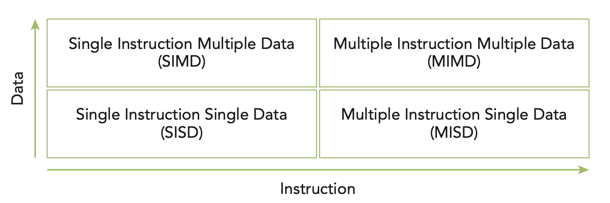
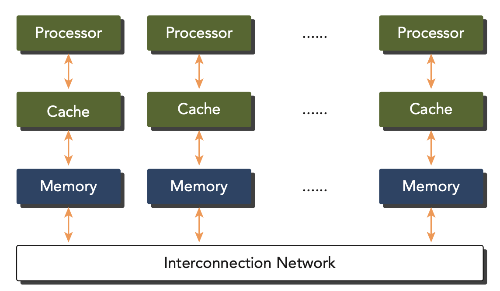
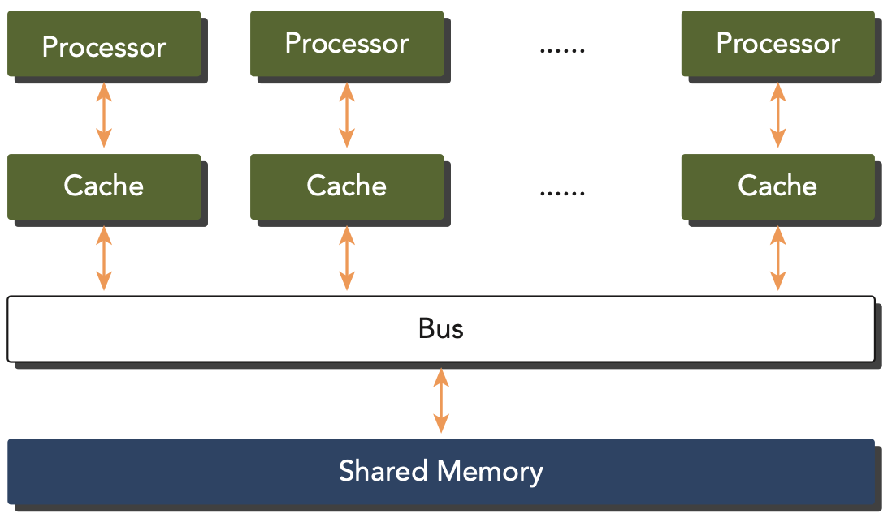

# Computer Architecture
- Flynn's Taxonomy scheme classifies computer architectures into four categories based on the number of instruction streams and data streams that are available in the architecture. The four categories are:
    - **SISD (Single Instruction, Single Data)**: traditional computer: a serial architecture where a single instruction stream operates on a single data stream.
    - **SIMD (Single Instruction, Multiple Data)**: a type of parallel architecture where a single instruction stream operates on multiple data streams. This architecture is used in vector processors and GPUs.
    - **MISD (Multiple Instruction, Single Data)**: uncommeon architecture where each core operates on the same data stream via seprate instruction streams.
    - **MIMD (Multiple Instruction, Multiple Data)**: a type of parallel architecture where multiple instruction streams operate on multiple data streams. Many MIMD also include SIMD excecution sub-components.

    
    
Flynn's Taxonomy scheme

- At the architectural level, many advances have been made to achieve the following objectives:
    - Decrease latency: the time it takes to complete a task.
    - Increase throughput: the number of tasks that can be completed in a given time, commonly measured in FLOPS (floating-point operations per second).
    - Increase bandwidth: the amount of data that can be transferred in a given time.

- Computer architectures can also be subdivided by their memory organization, which is generally classified into the following two types:
    - **Shared Memory Architecture** and **Distributed Memory Architecture**:
    

        
        
    

    - Multinode architecture: each node has its own memory and communicates with other nodes through a network, which are often referred to as clusters.
    - Multiprocessor architecture: all processors share the same memory or shared a low-latency link (such as PCIe - Peripheral Component Interconnect Express) to communicate with each other.