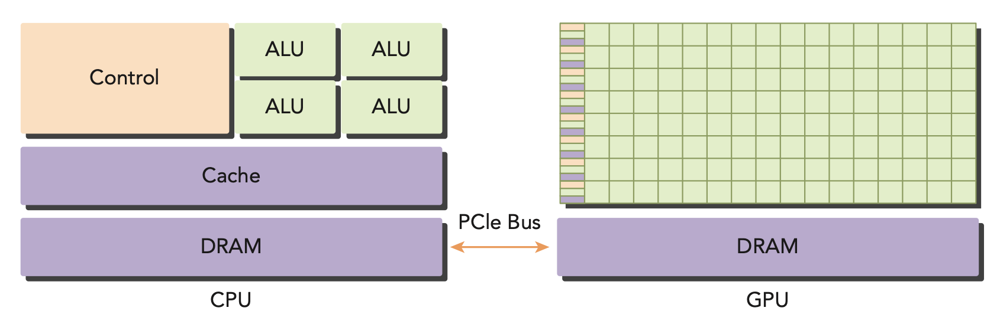
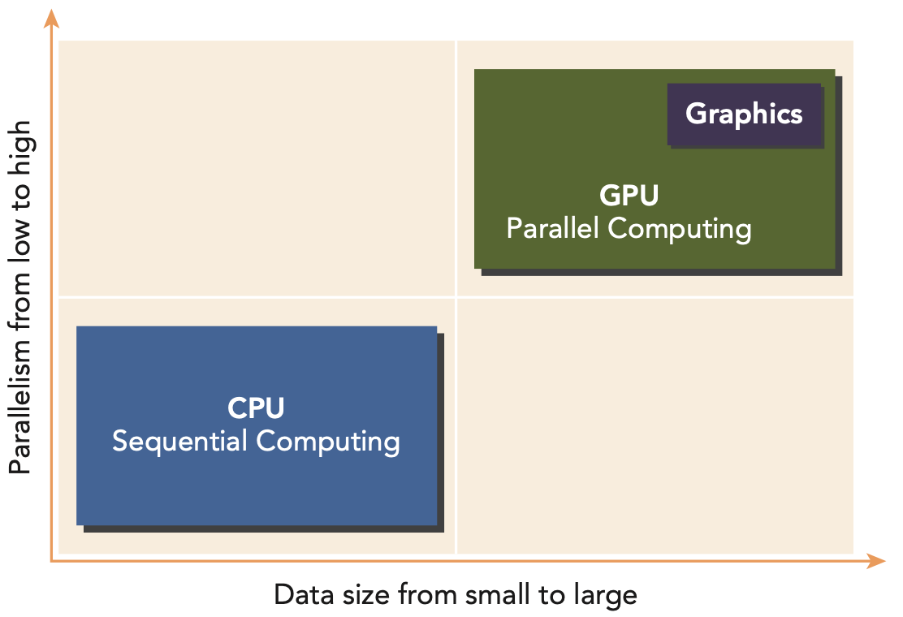
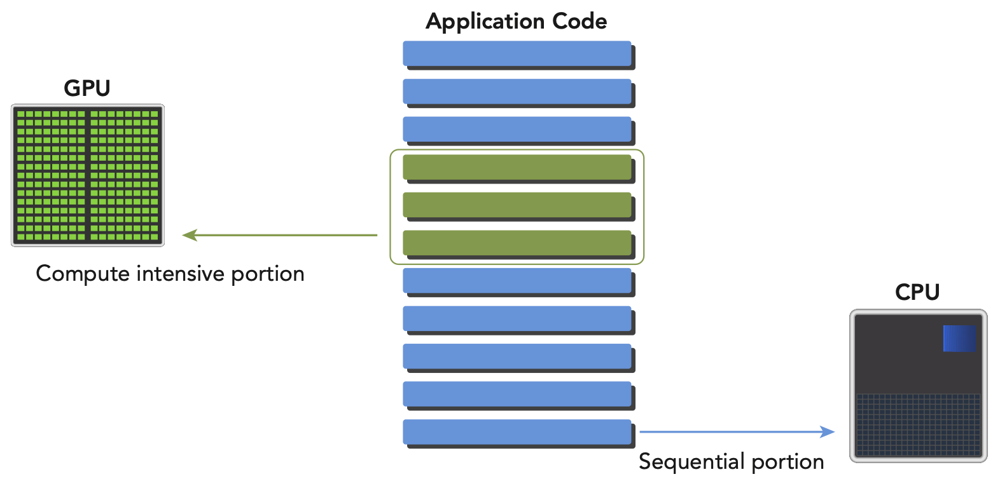

# Heterogeneous Computing

## Heterogeneous Architecture
- A heterogeneous applucation consists of two parts:
    - **Host**: the CPU, which is the primary processor in the system.
    - **Device**: the GPU, which is the secondary processor in the system.
    

- There are two important features that describe GPU capabilities:
    - Number of CUDA cores: the number of cores in the GPU that can execute a thread.
    - Memory bandwidth: the rate at which data can be read from or written to the memory.

## Paradigm of Heterogeneous Computing
- If a problem has a small data size, sophisticated control logic, and/or low-level parallelism, the CPU is a good choice because of its ability to handle complex logic and instruction-level parallelism. If the problem at hand instead processes a huge amount of data and exhibits massive data parallelism, the GPU is the right choice because it has a large number of programmable cores, can support massive multi-threading, and has a larger peak bandwidth compared to the CPU.

- CPU + GPU heterogeneous parallel computing architectures evolved because the CPU and GPU have complementary attributes that enable applications to perform best using both types of processors. Therefore, for optimal performance you may need to use both CPU and GPU for your application, executing the sequential parts or task parallel parts on the CPU and intensive data parallel parts on the GPU
