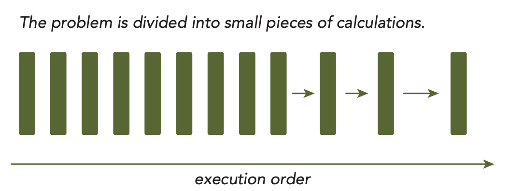
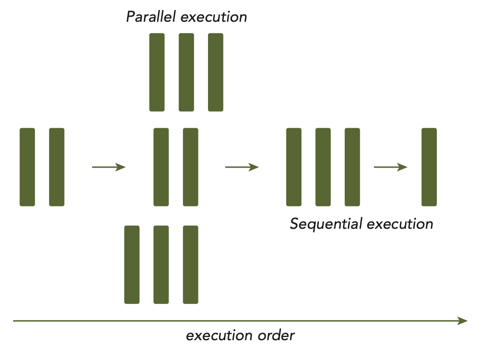

# Parallel Computing

- Parallel computing: how to map the concurrent execution of multiple tasks to the underlying hardware architecture - breaking down a problem into smaller tasks and executing them simultaneously, usually involves two distinct areas of computing technology: 
    - **Computer Achitecture** (hardware aspect)
    - **Parallel Programming** (software aspect)

- Computer Architecture: In order to achieve parallelism, the hardware must provide a platform that supports concurrent execution of multiple processes or mutiple threads.

    
    
Harvard Architecture

    

    - The key components in HPC is the CPU. Programming can be viewed as a process of mapping the computation of a problems to available cores (in the cpu) such that parallelism can be exploited.

- Sequential and Parallel Computing: 
    
    
Sequential and Parallel Computing

    
    
Sequential and Parallel Computing

    - A parallel programm may, and most likely will, have some sequential parts.
    - From the eye of a programmer, a program consists of two basic ingredients: instruction and data. When a computational problem is broken down into many small pieces of computation, each piece is called a task. In a task, individual instructions consume inputs, apply a function, and produce outputs. A data dependency occurs when an instruction consumes data produced by a preceding instruction. Therefore, you can classify the relationship between any two tasks as either dependent, if one consumes the output of another, or independent. Analyzing data dependencies is a fundamental skill in implementing parallel algorithms because dependencies are one of the primary inhibitors to parallelism, and understanding them is necessary to obtain application speedup in the modern programming world. In most cases, multiple independent chains of dependent tasks offer the best opportunity for parallelization.

- Parallelism
    - **Task Parallelism**: arises when there are many tasks or functions that can be operated independently and largely in parallel. Task parallelism focuses on distributing functions across multiple cores.
    - **Data Parallelism**: arises when there are many data items that can be operated on at the same time. Data parallelism focuses on distributing the data across multiple cores.

- CUDA programming is especially well-suited to address problems that can be expressed as data-parallel computations. The major focus of this book is how to solve a data-parallel problem with CUDA programming. Many applications that process large data sets can use a data-parallel model to speed up the computations. Data-parallel processing maps data elements to parallel threads.
    
    
Block vs Cyclic Partition

- Usually data is stored in 1D in physical storages even though it may be multidimensional. Determining how to distrubute data among threads is closely related to both how that data is store physically, as well as how the execution of each thread is organized. The way you organize the threads has a significant impact on the performance of the program.