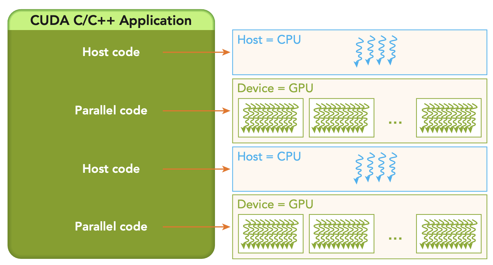

# CUDA Programming Structure

- A key concept in CUDA programming is the idea of a **kernel**. - the code that runs on the GPU. You still write your code sequentially while CUDA manages scheduling and execution of the kernel on the GPU.
- The CUDA programming model is primarily asynchronous. The CPU and GPU can work concurrently. The CPU can continue to work on other tasks while the GPU is executing a kernel.
    
- A typical processing flow of a CUDA program is as follows:
    1. Copy data from CPU to GPU
    2. Invoke a kernel to operate on the data stored on the GPU
    3. Copy the results back to the CPU