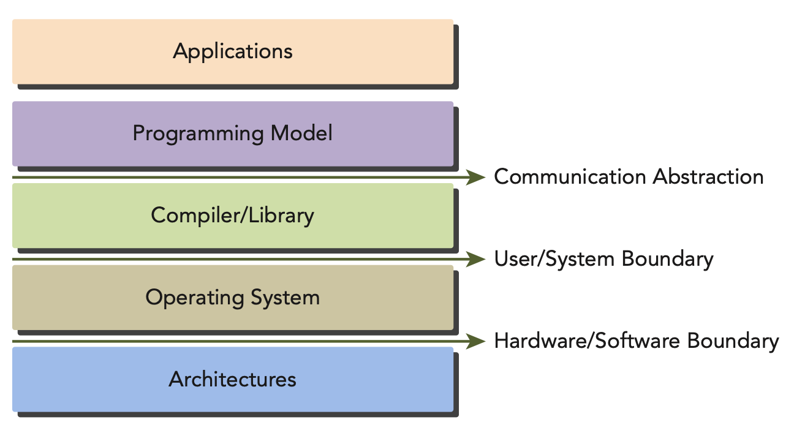

# Introduction

- Programming Model present an abstraction of computer architecture that acts as a bridge between an application and its implementation on available hardware.

- From the perspective of a programmer, you can view parallel computation from different levels such as:
    - Domain level
    - Logic level
    - Hardware level
- As you work through your program and algorithm design, your main concern is at the domain level:
how to decompose data and functions so as to solve the problem correctly and effi ciently while running in a parallel environment. When you enter the programming phase, your concern turns to how to organize your concurrent threads. During this phase you are thinking at the logic level to ensure your threads and calculations solve the problem correctly.
