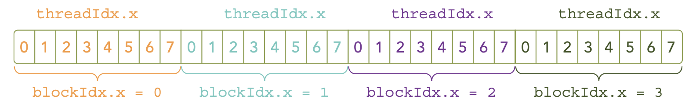

# Launching a CUDA kernel

- A CUDA Kernel call is direct extension of the C function syntax that adds a kernel's execution configuration in triple angle brackets `<<<>>>` after the function name.
```cpp
kernel_name<<<grid, block>>>(argument list);
```
- Example of threads configuration:
    ```cpp
    kernel_name<<<4, 8>>>(argument list); // 4 blocks, 8 threads per block
    ```
    
- A kernel call is asynchronous with respect to the host thread. After a kernel is invoked, control returns to the host side immediately. You can call the function `cudaError_t cudaDeviceSynchronize(void)` to block the host thread until the kernel completes.

