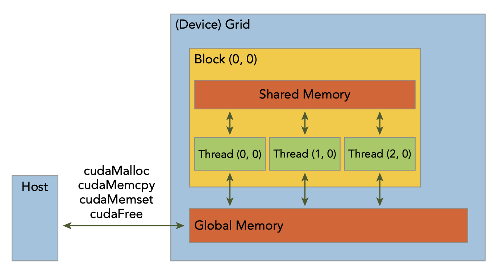

# Managing Memory

Host and Device Memory Functions Table
|Standard C|CUDA|Description|
|---|---|---|
|malloc|cudaMalloc|Allocate memory on the device|
|free|cudaFree|Free memory on the device|
|memcpy|cudaMemcpy|Copy memory between host and device|
|memset|cudaMemset|Set memory on the device|

- The function used to perform GPU memory allocation is cudaMalloc, and its function signature is:
    ```cpp
    cudaError_t cudaMalloc(void** devPtr, size_t size);
    ```
    - The first argument is a pointer to a pointer that will store the address of the allocated memory.
    - The second argument is the size of the memory to allocate in bytes.
    - The return value is a cudaError_t type that indicates whether the function call was successful.
- The function used to free memory on the device is cudaFree, and its function signature is:
    ```cpp
    cudaError_t cudaFree(void* devPtr);
    ```
    - The argument is a pointer to the memory to free.
    - The return value is a cudaError_t type that indicates whether the function call was successful.
- The function used to copy memory between the host and device is cudaMemcpy, and its function signature is:
    ```cpp
    cudaError_t cudaMemcpy(void* dst, const void* src, size_t count, cudaMemcpyKind kind);
    ```
    - The first argument is the destination pointer.
    - The second argument is the source pointer.
    - The third argument is the number of bytes to copy.
    - The fourth argument is an enumerated type that specifies the direction of the copy.
        - cudaMemcpyHostToHost
        - cudaMemcpyHostToDevice
        - cudaMemcpyDeviceToHost
        - cudaMemcpyDeviceToDevice
- The function used to set memory on the device is cudaMemset, and its function signature is:
    ```cpp
    cudaError_t cudaMemset(void* devPtr, int value, size_t count);
    ```
    - The first argument is the pointer to the memory to set.
    - The second argument is the value to set the memory to.
    - The third argument is the number of bytes to set.

- Memory Hierachy
    - In the GPU memory hierarchy, the two most important types of memory are global memory and shared memory. Global memory is analogous to CPU system memory, while shared memory is similar to the CPU cache. However, GPU shared memory can be directly controlled from a CUDA C kernel.
    
