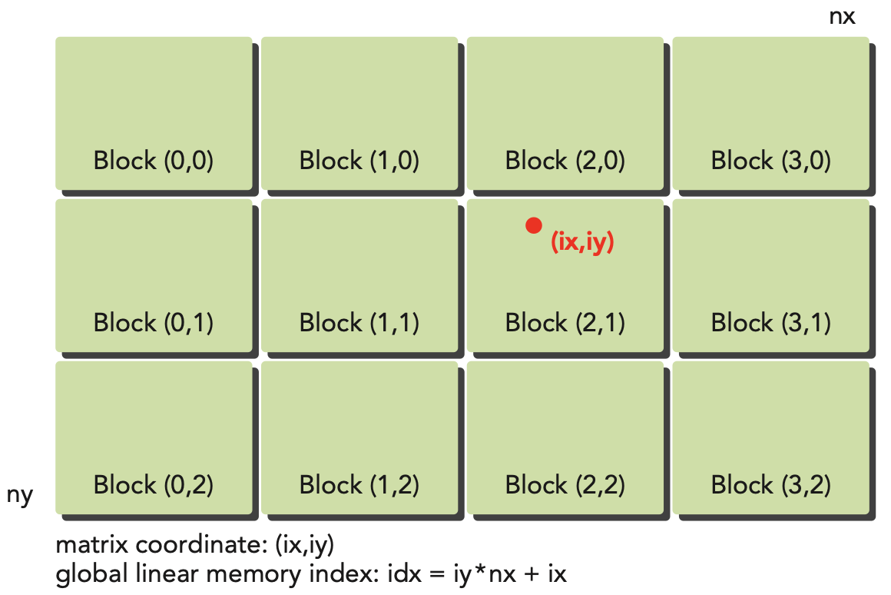

# Organizing Parallel Threads

## Indexing Matrices with Blocks and Threads
- Typically, a matrix is stored linearly in global memory with a row-major approach. In a matrix addition kernel, a thread is usually assigned one data element to process. Accessing the assigned data from global memory using block and thread index is the issue that needs to be addressed. Typically, there are three kinds of indices for a 2D case:
    - Thread and block index
    - Coordinate of a given point in the matrix
    - Offset in linear global memory
- For a given thread, you can obtain the offset in global memory from the block and thread index by first mapping the thread and block index to coordinates in the matrix, then mapping those matrix coordinates to a global memory location.
    - 1st step: map the block and thread index to coordinates in the matrix
        - ix = threadIdx.x + blockIdx.x * blockDim.x;
        - iy = threadIdx.y + blockIdx.y * blockDim.y;
    - 2nd step: map the matrix coordinates to a global memory location
        - idx = ix + iy * nx; // nx is the width of the matrix
    
    <p align="center">
    <i>Relationship among block and thread indices, matrix coordinates, and linear global memory indices.</i>
    </p>

- The function printThreadInfo() is used to print out the following information about each thread:
    - Thread index
    - Block index
    - Matrix coordinate
    - Global linear memory offset
    - Value of corresponding elements
    
    <p align="center">
    <i>thread_id (2,1) block_id (1,0) coordinate (6,1) global index 14 ival 14</i>
    </p>

## Summing matrices with a 2D grid and 2D blocks
- For this setup, if the number of the total threads are equal or greater than the number of elements in the matrix, then each threads will process only one element.
- 2D grid and 2D blocks are used to sum two matrices. The kernel is called sumMatrixOnGPU2DGrid2DBlock(). The kernel is launched with a 2D grid and 2D blocks. The kernel is defined as follows:
    ```cpp
    __global__ void sumMatrixOnGPU2DGrid2DBlock(float *A, float *B, float *C, int nx, int ny) {
        unsigned int ix = threadIdx.x + blockIdx.x * blockDim.x;
        unsigned int iy = threadIdx.y + blockIdx.y * blockDim.y;
        unsigned int idx = ix + iy * nx;
        // process only one element in the matrix
        if (ix < nx && iy < ny) {
            C[idx] = A[idx] + B[idx];
        }
    }
    ```
    
- Matrix Summation with Different Execution Configuration
    | Kernel Configuration | Kernel Eslapsed Time | Block Number |
    |----------------------|----------------------|--------------|
    | (32, 32)             | 0.060323s            | 512x512      |
    | (32, 16)             | 0.038041s            | 512x1024     |
    | (16, 16)             | 0.045535s            | 1024x1024    |
    - The table show that increasing the number of blocks does not nessarily always increase the performance of the kernel. We will learn why different configurations have different performance in the Chapter 3.

## Summing Matrices with a 1D grid and 1D blocks
- For this setup, each thread is assigned to process one row of the matrix, ny elements.
- The kernel sumMatrixOnGPU1DGrid1DBlock() is used to sum two matrices with a 1D grid and 1D blocks. The kernel is defined as follows:
    ```cpp
    __global__ void sumMatrixOnGPU1DGrid1DBlock(float *A, float *B, float *C, int nx, int ny) {
        unsigned int ix = threadIdx.x + blockIdx.x * blockDim.x;
        // each thead process one row which is ny elements
        if (ix < nx) {
            for (int iy = 0; iy < ny; iy++) {
                unsigned int idx = ix + iy * nx;
                C[idx] = A[idx] + B[idx];
            }
        }
    }
    ```
    

## Summing Matrices with a 2D grid and 1 blocks
- For this setup, each thread takes care of only one data element and the second dimension of grid equals ny.
- The kernel sumMatrixOnGPU2DGrid1DBlock() is used to sum two matrices with a 2D grid and 1D blocks. The kernel is defined as follows:
    ```cpp
    __global__ void sumMatrixOnGPU2DGrid1DBlock(float *A, float *B, float *C, int nx, int ny) {
        unsigned int ix = threadIdx.x + blockIdx.x * blockDim.x;
        // the second dimension of grid equals ny
        unsigned int iy = blockIdx.y;
        unsigned int idx = ix + iy * nx;
        if (ix < nx && iy < ny) {
            C[idx] = A[idx] + B[idx];
        }
    }
    ```
    

**Results Comparison**

| Kernel  | Execution Configuration | Time Elapsed |
|---------|-------------------------|--------------|
|sumMatrixOnGPU2D | (512, 1024), (32, 16) | 0.038041s |
|sumMatrixOnGPU1D | (128, 1), (128, 1) | 0.044701s |
|sumMatrixOnGPUMix | (64,16384), (256,1) | 0.030765s |

- From the matrix addition examples, you can see several things:
    - Changing execution configurations affects performance. 
    - A naive kernel implementation does not generally yield the best performance. 
    - For a given kernel, trying different grid and block dimensions may yield better performance. 

In Chapter 3, you will learn more about what causes these issues from a hardware perspective.