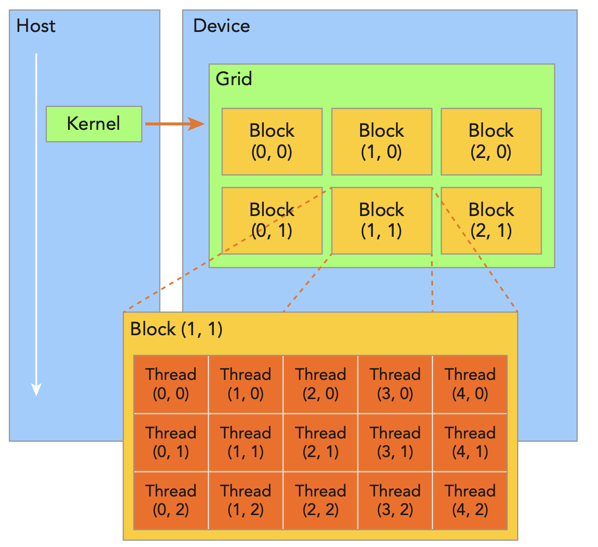

# Organizing Threads

- CUDA exposes a two-level abstraction hierarchy for organizing threads: **grids** of blocks and **blocks** of threads to enable you to organize your threads.
    

- All threads spawned by a single kernel launch are collectively called a grid. All threads in a grid share the same global memory space. A grid is made up of many thread blocks. A thread block is a group of threads that can cooperate with each other using:
    - Block-local synchronization
    - Block-local shared memory
- Threads from different blocks cannot cooperate.
- Threads rely on the following two unique coordinates to distinguish themselves from each other:
    - blockIdx (block index within a grid)
    - threadIdx (thread index within a block)
- These variables appear as built-in, pre-initialized variables that can be accessed within kernel functions. When a kernel function is executed, the coordinate variables blockIdx and threadIdx are assigned to each thread by the CUDA runtime. Based on the coordinates, you can assign portions of data to different threads.
- The coordinat variables are of type uint3, which is a CUDA-specific data type that is a three-dimensional vector. The x, y, and z components of the dim3 type are used to represent the x, y, and z dimensions of the grid and block: blockIdx.x, blockIdx.y, blockIdx.z, threadIdx.x, threadIdx.y, and threadIdx.z.
- The dimensions of a grid and block are specified by the following two built-in variables:
    - gridDim  (grid dimension, measured in blocks)
    - blockDim (block dimension, measured in threads)
- Usually a grid is organized as a two-dimensional array of blocks, and a block is organized as a three-dimensional array of threads.

- Access grid/block variables from the host and devive side. 
    - It is important to distinguish between the host and device access of grid and block variables. For example, using a variable declared as block from the host, you define the coordinates and access them as follows: block.x, block.y, and block.z
    - On the device side, you have pre-initialized, built-in block size variable available as: blockDim.x, blockDim.y, and blockDim.z

## Steps to Organize Threads
- For a given data size, the general steps to organize threads are as follows:
    1. Decide the block size
    2. Calculate the grid dimensions based on the application data size and block size
- To determine the block size, consider the following:
    - Perfromance characteristics of the kerel
    - Limitations of the GPU resources