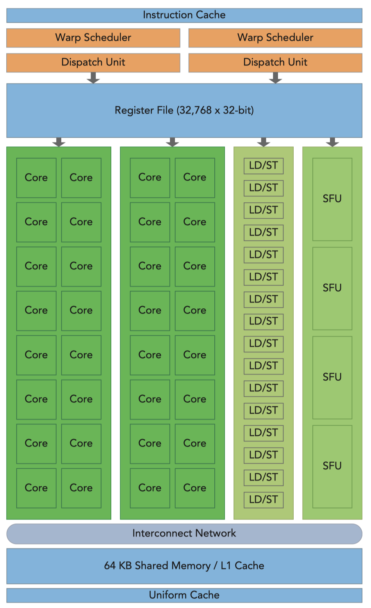
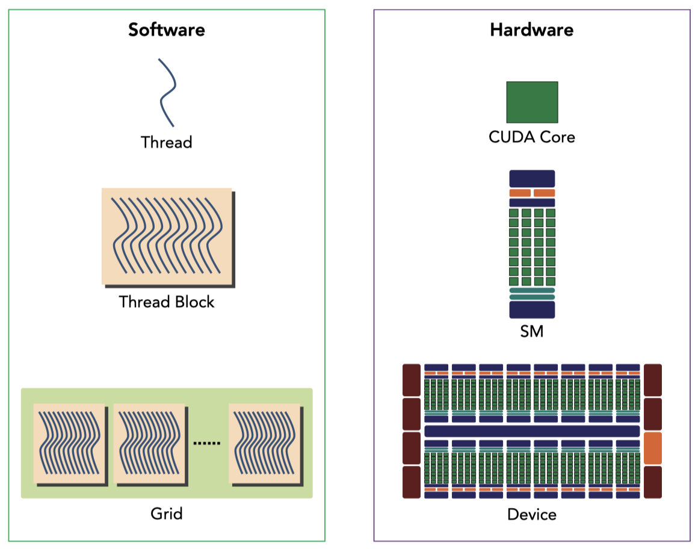

# Introduction

## GPU Architecture Overview
- The GPU architecture is built around a scalable array of multithreaded Streaming Multiprocessors (SMs).

- Each SM is designed to support concurrent execution of thousands of threads, and there are multiple SMs on a single GPU.
- Multiple thread blocks may be assigned to the same SM at once and are scheduled based on the availability of resources.
- CUDA employs a Single Instruction, Multiple Thread (SIMT) architecture to manage and execute threads in groups of 32 called warps. All threads in a warp execute the same instruction at the same time.. Each thread has its own instruction address counter and register state, and is managed by the warp scheduler.
- The SIMT is similar to SIMD, both implement parallelism by executing the same instruction on multiple execution units. A key difference is that SIMD requires that all vector elements in a vector execute together in a unified synchronous group, whereas SIMT allows multiple threads in the same warp to execute independently.
- The SIMT model includes three key features that SIMD does not:
    - Each thread has its own instruction address counter and register state.
    - Each thread can have an independent execution path.

- Shared memory and register are precious resources in an SM. **Shared memory is partitioned among thread blocks resident on the SM and registers are partitioned among threads**. Threads in a thread block can cooperate and communicate with each other through these resources. Different threads in a thread block may make progress at a different pace.

## Profile-Driven Optimization
- Profiling is the act of analyzing program performance by measuring:
    - The space (memory) or time complexity of a program.
    - The usage of particular instructions or hardware components.
    - The frequency and duration of function calls.
- Profiling is a critical step in progran development, especially for optimizing HPC application code, which often requires basic understanding of the execution model of the target hardware. Two major steps in profiling are:
    - Developing the code for correctness
    - Improveing the code for performance
- A naive kernel implementation generally does not yeild the best performance. Profiling tools can help identify bottlenecks and guide optimization efforts.
- CUDA partitions the compute resources in an SM among multiple resident thread blocks. This partitioning causes some resources to become performance limiters. Profiling tools can help you gain insight into how compute resources are being utilized.
- CUDA provides an abtraction of the hardware achitecture enabling you to control thread concurrency. Profiling tools can help you measure, visualize, and guide your optimizations.
- CUDA provides two primary profiling tools: nvvp, a standalone visual profi ler; and nvprof, a command-line profiler.
- There are three common limiters to performance for a kernel that you may encounter:
    - Memory bandwidth
    - Compute resources
    - Instruction and memory latency
- **This chapter focuses on the issue of instruction latency and partially on compute resource limitations. Subsequent chapters will cover the remaining performance limiters.**