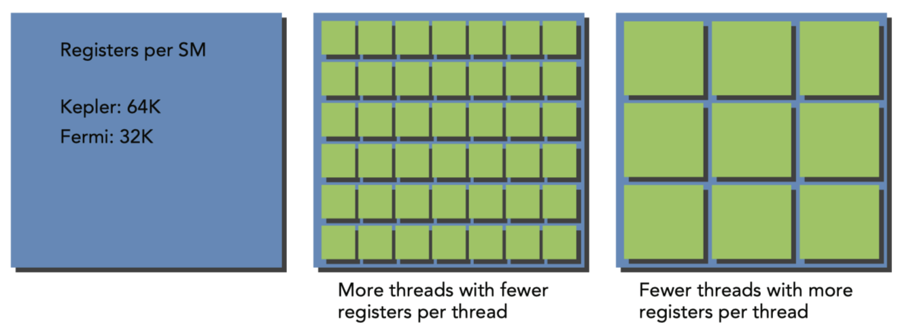
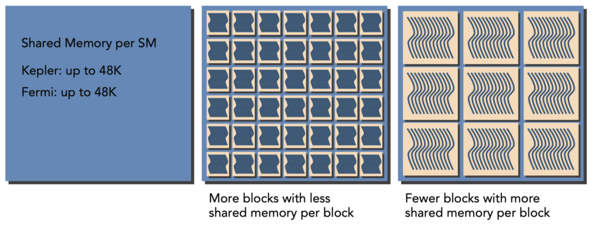
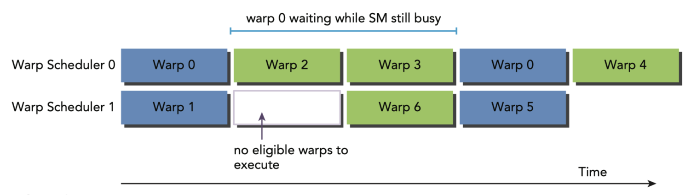
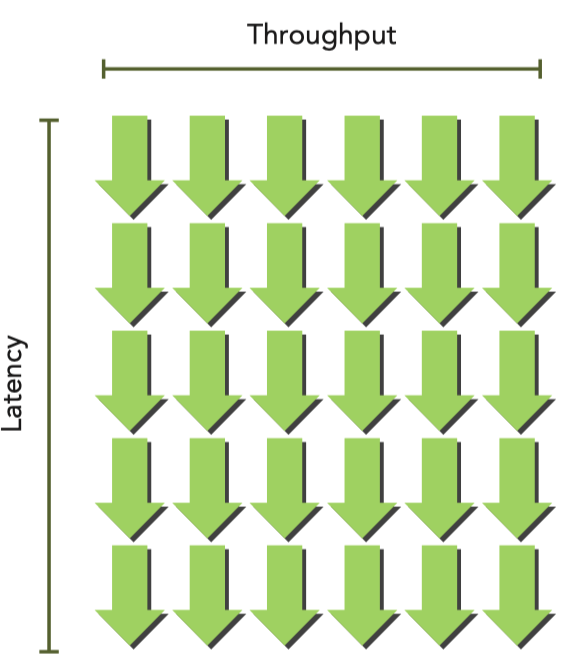

# Understand the Nature of Warp Execution

## Warps and Thread Blocks
- Warps are the basic unit of execution in an SM. Each SM has a number of warps that it can execute concurrently. The number of warps that can be executed concurrently is determined by the number of CUDA cores in the SM. Each warp consists of 32 threads. The threads in a warp execute the same instruction at the same time. This is called SIMD (Single Instruction, Multiple Data) execution. 

- Thread blocks can be configured to be one-, two-, or three-dimensional. However, from the hardware perspective, all threads are arranged one-dimensionally.
- The logical layout of a two or three-dimensional thread block can be converted into its one-dimensional physical layout by using the x dimension as the innermost dimension, the y dimension as the second dimension, and the z dimension as the outermost. For example, given a 2D thread block, a unique identifier for each thread in a block can be calculated using the built-in threadIdx and blockDim variables: `threadIdx.y * blockDim.x + threadIdx.x`
- The same calculation for a 3D thread block is as follows: `threadIdx.z * blockDim.y * blockDim.x + threadIdx.y * blockDim.x + threadIdx.x`
- The number of warps for a thread block can be determined as follows: `ceil(threadsPerBlock / warpSize)`
- A warp is never split between thread blocks. If a thread block has fewer threads than a warp, the remaining threads are inactive. 


## Warp Divergence
- GPUs are comparatively simple devices without complex branch prediction hardware. Because all the threads in a warp must execute the same instruction at the same time. If one thread executes an instructions, all the other threads in the warp must also execute that instruction. This could become a problem if threads in the same warp take different paths through an application. For example, consider the following statement:
```cpp
    if (cond) { 
        ...
    } else {
        ... 
    }
```
- Suppose that the condition `cond` is true for half of the threads in a warp and false for the other half. In this case, the warp will execute both the `if` and `else` blocks. The threads that are not supposed to execute the block will be masked off. This is called warp divergence.
- If threads of a warp diverge, the warp executes serially each branch path, disabling threads that do not take this path. Warp diverge can cause a significant decrease in performance. In the example only half of the threads are active at any given time, if more conditional branch, the loss of parallelism will be more severe.
- This happens only inside in one warp. If different warps take different paths, the GPU can still execute them in parallel.
    ```cpp
    __global__ void mathKernel2(void) {
        int tid = blockIdx.x * blockDim.x + threadIdx.x; 
        float a, b;
        a = b = 0.0f;
        if ((tid / warpSize) % 2 == 0) { // Even-numbered warps
            a = 100.0f;
        } else {
            b = 200.0f;
        }
        c[tid] = a + b;
    }
    ```
- In the above example, the threads in the even-numbered warps will execute the `if` block, and the threads in the odd-numbered warps will execute the `else` block. This will not cause warp divergence because the threads in the same warp are executing the same instruction.
- To check for warp divergence, you can use the `nvprof` tool. (this tool is replaced by `nsight-systems` and `nsight-compute` in the latest CUDA toolkit)
```bash
    !ncu --metrics smsp__sass_branch_targets_threads_divergent.avg,smsp__sass_branch_targets_threads_divergent.sum ./test
```
### Key Reminder
- Warp divergence occurs when threads within a warp take different code paths.
- Different if-then-else branches are executed serially.
- Try to adjust branch granularity to be a multiple of warp size to avoid warp divergence.
- Different warps can execute different code with no penalty on performance.

## Resource Partitioning
- The local execution context of a warp mainly consists of the following resources:
    - Program counters
    - Registers
    - Shared memory


- Resource availability generally linits the number of resident thread blocks per SM. The number of registers and the amount of shared memory per SM vary for devices of different compute capabilities. If there are insufficient registers or shared memory to process at least one thread block, the kernel will fail.
### Summary Comparison

    | **Feature**     | **Program Counter**               | **Registers**                  | **Shared Memory**              |
    |------------------|-----------------------------------|---------------------------------|---------------------------------|
    | **Scope**       | Warp-level                        | Thread-private                 | Thread-block-wide              |
    | **Speed**       | Fast (warp-level control)         | Fastest memory                 | Fast (on-chip memory)          |
    | **Capacity**    | 1 per warp                        | Limited per SM (e.g., 65536)   | Limited per SM (e.g., 48 KB)   |
    | **Usage**       | Tracks thread execution paths     | Stores local variables         | Shares data across threads      |
    | **Programming** | Implicit (handled by hardware)    | Implicit (allocated per thread)| Explicit (programmer-managed)  |
- A thread block is called an active block when computer resources, such as registers and shared memory, have been allocated to it. The warps in an active block are called active warps, and can be further classified into following three types:
    - Selected warps: Warps that are currently executing on the SM.
    - Eligible warps: Warps that are ready to execute but are not currently executing
    - Stalled warps: Warps that are not ready to execute
- A warp is  eligible for excution if both of the following conditions are met:
    - 32 CUDA cores are available for execution
    - All arguments to the current instruction are ready
- **In order to maximize GPU ultilization, the number of active warps should be kept as high as possible.**

## Latency Hiding
- Full compute resource ultilization is achieved when all warp schedulers have an eligible warp at every clock cycle, which ensures that the latency of each instruction can be hidden by issuing instructions from other warps. GPU instruction latency is hidden by computation from other warps.
- Two types of instruction latency:
    - Arithmetic instructions: approximately 10-20 clock cycles
    - Memory instructions: 400-800 clock cycles for global memory access
    
- Little's Law can be used to calculate the number of active warps required to hide memory latency:
    - `Number of Required Warps = Latency x Throughput`
    - Suppose the average latency for an instruction in your kernel is 5 cycles. To keep a throughput of 6 warps executed per cycle, you will need at least 30 warps in-flight.
    
    <p style="text-align: center;">Little's Law Example</p>


### Throughput and Bandwidth
- Bandwidth and throughput are often confused, but may be used interchangeably depending on the situation. Both throughput and bandwidth are rate metrics used to measure performance.
- Bandwidth: the highest possible amount of data transferred per time unit.
- Throughput: the actual amount of data transferred per time unit. 
- Understanding SM Parallelism
    | **GPU Model** | **Instruction Latency (Cycles)** | **Throughput (Operations/Cycle)** | **Parallelism (Operations)** |
    |---------------|----------------------------------|------------------------------------|------------------------------|
    | Fermi         | 20                               | 32                                 | 640                          |
    | Kepler        | 20                               | 192                                | 3,840                        |
    - For Fermi, Parallelism = 20 cycles × 32 operations/cycle = 640 operations. To keep issuing instructions while hiding latency, you need at least 640 operations in-flight, which means you need at least the number of active warps to be 640/32 = 20 warps.
    - For Kepler, Parallelism = 20 cycles × 192 operations/cycle = 3,840 operations. To keep issuing instructions while hiding latency, you need at least 3,840 operations in-flight, which means you need at least the number of active warps to be 3,840/192 = 20 warps.
- Two ways to increase the number of active warps:
    - Instruction-level parallelism (ILP): More independent instructions within a thread
    - Thread-level parallelism (TLP): More concurrently eligible threads
- Device Parallelism Required to Maintain Full Memory Utilization
    | **GPU Model** | **Instruction Latency (Cycles)** | **Bandwidth (GB/Sec)** | **Bandwidth (Bytes/Cycle)** | **Parallelism (KB)** |
    |---------------|----------------------------------|------------------------|-----------------------------|----------------------|
    | Fermi         | 800                              | 144                    | 92                          | 74                   |
    - To check memory frequency, use the `nvidia-smi` command.
    ```bash
    nvidia-smi -a -q -d CLOCK | fgrep -A 3 "Max Clocks" | fgrep "Memory"
    ```
    - Convert to bytes per cycle: 144 GB/sec / 1.566 GHz = 92 bytes/cycle
    - 92 bytes/cycle × 800 cycles = 74 KB of parallelism required to maintain full memory utilization - This data is for the entire device
    - Assume we need to process 74 KB of data per cycle. If the kernel processes 4 bytes per thread, we need at least 74 KB / 4 bytes = 18,500 threads to maintain full memory utilization.
    - Warp-level parallelism: 18,500 threads / 32 threads per warp = 579 warps as each warp has 32 threads.

## Occupancy
- occupancy = active warps / maximum warps
- Occupancy is a measure of how well the GPU is being utilized. It is the ratio of active warps to the maximum number of warps that can be executed concurrently on an SM.

## Synchonization
