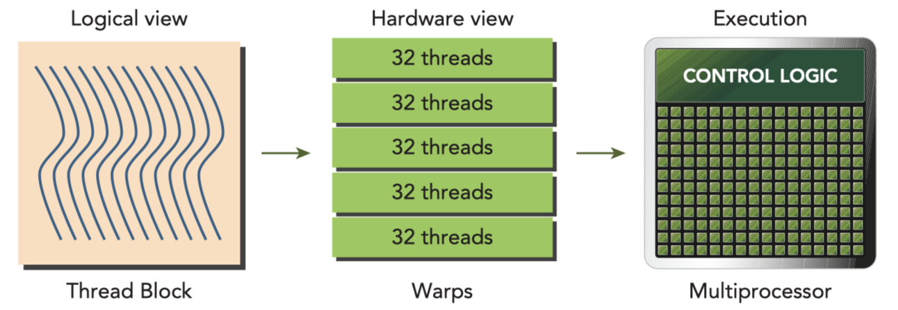
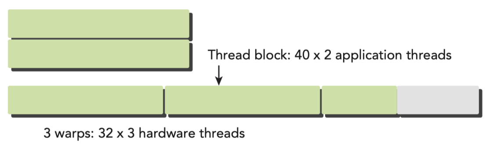

# Understand the Nature of Warp Execution

## Warps and Thread Blocks
- Warps are the basic unit of execution in an SM. Each SM has a number of warps that it can execute concurrently. The number of warps that can be executed concurrently is determined by the number of CUDA cores in the SM. Each warp consists of 32 threads. The threads in a warp execute the same instruction at the same time. This is called SIMD (Single Instruction, Multiple Data) execution. 

- Thread blocks can be configured to be one-, two-, or three-dimensional. However, from the hardware perspective, all threads are arranged one-dimensionally.
- The logical layout of a two or three-dimensional thread block can be converted into its one-dimensional physical layout by using the x dimension as the innermost dimension, the y dimension as the second dimension, and the z dimension as the outermost. For example, given a 2D thread block, a unique identifier for each thread in a block can be calculated using the built-in threadIdx and blockDim variables: `threadIdx.y * blockDim.x + threadIdx.x`
- The same calculation for a 3D thread block is as follows: `threadIdx.z * blockDim.y * blockDim.x + threadIdx.y * blockDim.x + threadIdx.x`
- The number of warps for a thread block can be determined as follows: `ceil(threadsPerBlock / warpSize)`
- A warp is never split between thread blocks. If a thread block has fewer threads than a warp, the remaining threads are inactive. 


## Warp Divergence
- GPUs are comparatively simple devices without complex branch prediction hardware. Because all the threads in a warp must execute the same instruction at the same time. If one thread executes an instructions, all the other threads in the warp must also execute that instruction. This could become a problem if threads in the same warp take different paths through an application. For example, consider the following statement:
```cpp
    if (cond) { 
        ...
    } else {
        ... 
    }
```
- Suppose that the condition `cond` is true for half of the threads in a warp and false for the other half. In this case, the warp will execute both the `if` and `else` blocks. The threads that are not supposed to execute the block will be masked off. This is called warp divergence.
- If threads of a warp diverge, the warp executes serially each branch path, disabling threads that do not take this path. Warp diverge can cause a significant decrease in performance. In the example only half of the threads are active at any given time, if more conditional branch, the loss of parallelism will be more severe.
- This happens only inside in one warp. If different warps take different paths, the GPU can still execute them in parallel.
    ```cpp
    __global__ void mathKernel2(void) {
        int tid = blockIdx.x * blockDim.x + threadIdx.x; 
        float a, b;
        a = b = 0.0f;
        if ((tid / warpSize) % 2 == 0) { // Even-numbered warps
            a = 100.0f;
        } else {
            b = 200.0f;
        }
        c[tid] = a + b;
    }
    ```
- In the above example, the threads in the even-numbered warps will execute the `if` block, and the threads in the odd-numbered warps will execute the `else` block. This will not cause warp divergence because the threads in the same warp are executing the same instruction.
- To check for warp divergence, you can use the `nvprof` tool. (this tool is replaced by `nsight-systems` and `nsight-compute` in the latest CUDA toolkit)
```bash
    !ncu --metrics smsp__sass_branch_targets_threads_divergent.avg,smsp__sass_branch_targets_threads_divergent.sum ./test
```
### Key Reminder
- Warp divergence occurs when threads within a warp take different code paths.
- Different if-then-else branches are executed serially.
- Try to adjust branch granularity to be a multiple of warp size to avoid warp divergence.
- Different warps can execute different code with no penalty on performance.
