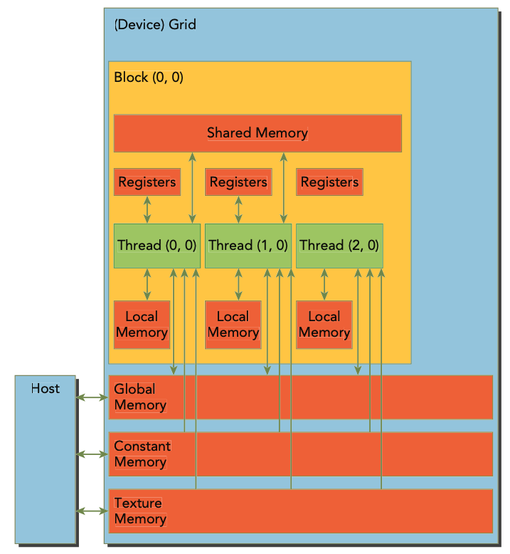

# Introducing the CUDA Memory Model

- Memory hierarchy

- Both CPU and GPU use similar memory hierarchy but CUDA programming model exposes more of the memory hierarchy to the programmer.

## CUDA Memory Model
- In CPU, L1 and L2 cache are non-programmable memory. On the other hand, the CUDA model exposes the memory hierarchy to the programmer:
    - Registers
    - Shared memory
    - Local memory
    - Global memory
    - Constant memory
    - Texture memory
    - Global memory

    

### Registers
- Registers are the fastest memory in the CUDA memory hierarchy.
- Registers are private to each thread.
- Registers are used to store local variables and intermediate results.
- Using fewer registers per thread allows more threads to be executed on a SM.
- If the number of registers used by a thread exceeds the limit, the compiler spills the registers to local memory, and the performance of the kernel is degraded.
- The number of registers used by a thread can be controlled using the `--ptxas-options=-v` compiler flag.

### Local Memory
- Varibles in a kernel that do not fit in registers are stored in local memory.
- Local memory is stored in global memory so it is slower than registers.

### Shared Memory
- Shared memory is a programmable memory that is shared among threads in a block.
- Declared using the `__shared__` keyword.
- Shared memory is on-chip memory that is faster than local or global memory.
- Each block has its own shared memory space.
- Each EM has a limited amount of shared memory that is shared among all blocks, so you must be careful not to use too much shared memory or the number of blocks that can be executed concurrently will be reduced.
- Access to shared memory must be synchronized using the `__syncthreads()` function.

### Constant Memory
- Constant memory is a programmable memory that is shared among all threads.
- Declared using the `__constant__` keyword.
- Must be declared with global scope, outside of any kernels.
- A limited amount of constant memory - 64 KB - is available to the device.
- Kernel can read from constant memory but cannot write to it.
- Constant memory therefore must be initialized on the host and cannot be modified by the device
    ```cpp
    cudaError_t cudaMemcpyToSymbol(const void* symbol, const void* src, size_t count);
    ```

### Texture Memory
- Texture memory is a programmable memory that is optimized for 2D spatial locality.
- Declared using the `texture` keyword.
- Texture memory is cached and read-only.

### Global Memory
- Global memory is the slowest memory in the CUDA memory hierarchy.
- Can be accessed on the device from any SM.
- Global memory is stored in device memory.

### GPU Caches
- Like CPUs, GPU caches are non-programmable memory. There are four types of caches:
    - L1 cache
    - L2 cache
    - Read-only constant
    - Read-only texture
- There is one L1 cache per SM and one L2 cache per GPU. Both caches are used to store data in local and global memory, including register spills.
- Each SM has a read-only constant cache and a read-only texture cache.

## CUDA Variable Declaration Summary

|Qualifier| Variable Name| Memory | Scope | Lifespan | 
|---|---|---|---|---|
| | float var | Register | Thread | Kernel |
| | float var[100] | Local | Thread | Kernel |
| `__shared__` | float var | Shared | Block | Block |
|` __device__`| float var | Global | Global | Application |
| `__constant__` | float var | Constant | Global | Application |

<p align="center">
    Table: CUDA Variable and Type Qualifier
</p>

|Memory| On-Chip/Off-Chip | Cache | Access | Scope | Lifetime |
|---|---|---|---|---|---|
| Register | On-Chip | No | Read/Write | 1 Thread | Thread |
| Local | Off-Chip | No | Read/Write | 1 Thread | Thread |
| Shared | On-Chip | No | Read/Write | All threads in block | Block |
| Global | Off-Chip | Yes | Read/Write | All threads + host | Host Allocation |
| Constant | Off-Chip | Yes | Read | All threads + host | Host Allocation |
| Texture | Off-Chip | Yes | Read | All threads + host | Host Allocation |

<p align="center">
    Table: Salient Features of Device Memory
</p>

## Static Global Memory
```cpp
#include <stdio.h>
#include <cuda_runtime.h>

__device__ float devData;

__global__ void checkGlobalVariable() {
    // Display the value of the global variable
    printf("Device: the value of the global variable is %f\n", devData);
    // Modify the value of the global variable
    devData += 2.0f;
}

int main() {
    // Initialize the global variable
    float value = 3.14f;
    cudaMemcpyToSymbol(devData, &value, sizeof(float));

    // Launch the kernel
    checkGlobalVariable<<<1, 1>>>();

    // Copy back the modified value of the global variable
    cudaMemcpyFromSymbol(&value, devData, sizeof(float));
    printf("Host: the value of the global variable is now %f\n", value);

    return 0;
}
```
- The `cudaMemcpyToSymbol()` and `cudaMemcpyFromSymbol()` functions are used to copy data to and from global memory.
- The `__device__` keyword is used to declare a variable in global memory.
- The devData is passed here as a symbol, not as the address of the variable in global memory.
- You cannot use cudaMemcpy() to copy data into devData because it is a symbol, not a pointer.
- To copy data to a symbol using cudaMemcpy(), you have to aquire the address of the symbol using cudaGetSymbolAddress().
```cpp
float *dptr = NULL;
cudaGetSymbolAddress((void**)&dptr, devData);
cudaMemcpy(dptr, &value, sizeof(float), cudaMemcpyHostToDevice);
```