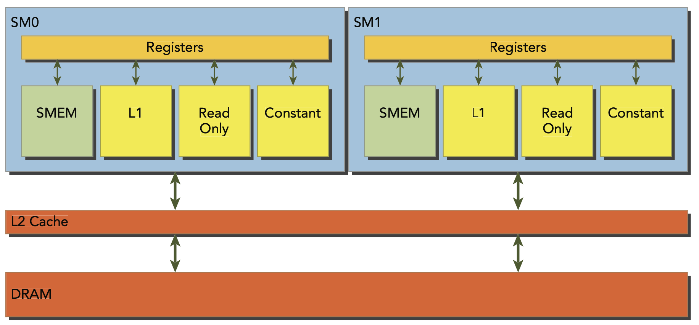
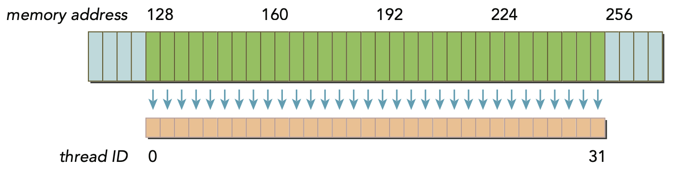
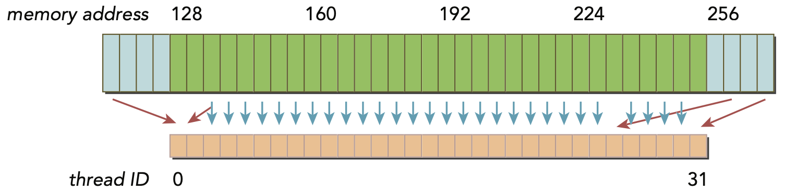
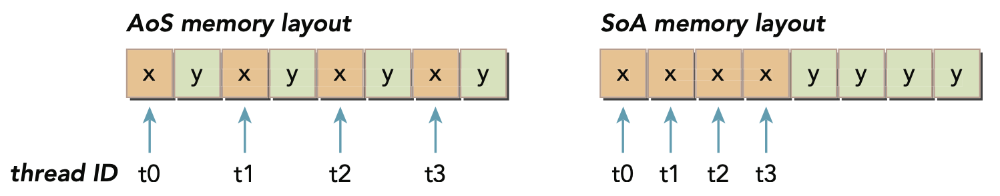

# Memory Access Patterns

## Aligned and Coalesced Memory Access

- Global memory load/store are staged through cache. All applications data initially resides in DRAM. All accesses through the L2 cache, some also through L1 cache depending on the access pattern of the GPU architecture.
- Aligned memory accesses occur when the fi st address of a device memory transaction is an even multiple of the cache granularity being used to service the transaction (either 32 bytes for L2 cache or 128 bytes for L1 cache). Performing a misaligned load will cause wasted bandwidth. If the cache granularity is 32 bytes (common for L2 cache), the starting address should be divisible by 32 (e.g., 0, 32, 64, etc.).
- Coalesced memory accesses occur when all 32 threads in a warp access a contiguous chunk of memory. If the threads’ IDs (tid) are sequential (0, 1, 2, …, 31), the memory accesses will be:  
	-	Thread 0 → arr[0]  
	-	Thread 1 → arr[1]  
	-	…  
	-	Thread 31 → arr[31]  

    - This pattern results in coalesced access because:
        - The addresses are contiguous.
        - The data is aligned with the cache line.



## Array of Structure vs Strucutre of Arrays
- Array of Structure (AoS):
    ```cpp
    struct innerStruct {
        float x;
        float y;
        float z;
    };

    struct innerStruct AoS[10];
    ```
- Structure of Arrays (SoA):
    ```cpp
    struct innerArray {
        float x[10];
        float y[10];
        float z[10];
    };
    struct innerArray SoA;
    ```

- Many parallel programming paradigms, in particular SIMD-style paradigms, prefer SoA. In CUDA C programming, SoA is also typically preferred because data ele-
ments are pre-arranged for effi cient coalesced access to global memory, since data
elements of the same fi eld that would be referenced by the same memory operation
are stored adjacent to each other.

## Performance Tuning
- Two goals of memory access optimization:
    - Aligned and coalesced memory accesses that reduce wasted bandwidth
    - Sufficient concurrent memory operations to hide memory latency

- Unrolling Techniques:
    - Loop unrolling is a common optimization technique used in programming and compilers to enhance performance by reducing the overhead of loop control and increasing instruction-level parallelism. It involves transforming a loop to perform multiple iterations per loop cycle.
    - Example:
        ```cpp
        for (int i = 0; i < N; i++) {
            a[i] = b[i] + c[i];
        }
        ```
        can be unrolled to:
        ```cpp
        for (int i = 0; i < N; i+=4) {
            a[i] = b[i] + c[i];
            a[i+1] = b[i+1] + c[i+1];
            a[i+2] = b[i+2] + c[i+2];
            a[i+3] = b[i+3] + c[i+3];
        }
        ```