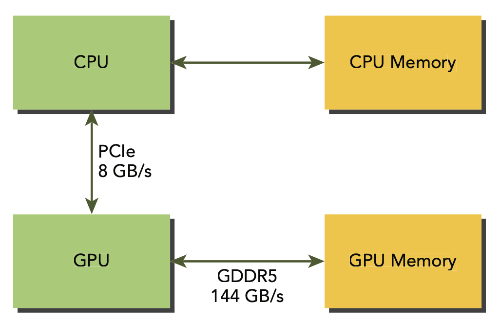
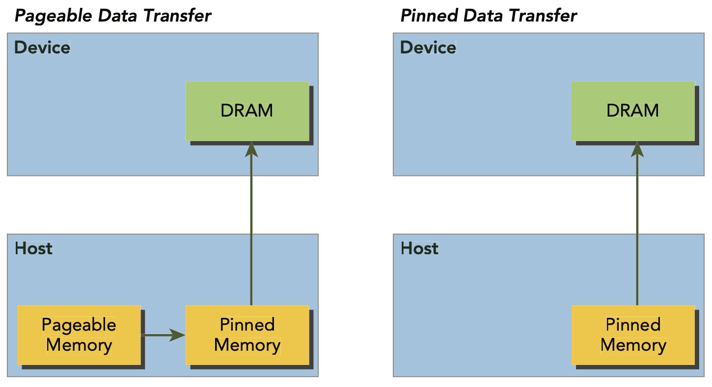
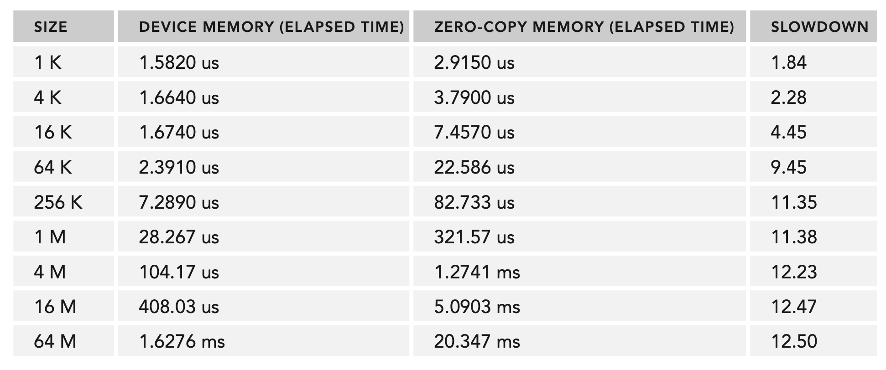
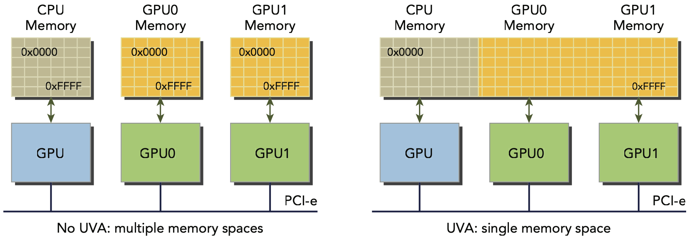

# Memory Management

## Memory Allocation and Deallocation
- The `cudaMalloc()` function is used to allocate memory on the device.
- The `cudaMemsset()` function is used to initialize the memory on the device.
- The `cudaFree()` function is used to deallocate memory on the device.

## Memory Transfer
- The `cudaMemcpy()` function is used to transfer data between the host and the device.

- From the figure above, we see that the peak bandwidth between the GPU chip and the on-board memory is very high, 144 GB/s, but the bandwidth between the GPU and the host is much lower, 8 GB/s. This disparity means that data transfers between the host and device can throttle the performance of your application if not managed properly.

## Pinned Memory
- Allocated host memory is pageable by default, meaning that the operating system can swap it to disk if necessary.
- Pinned memory is not pageable, meaning that it is locked in physical memory and cannot be swapped to disk.
- To transfer from pageable memory to the device, the CUDA driver must first allocate a pinned buffer, copy the data from pageable memory to the pinned buffer, and then transfer the data from the pinned buffer to the device, which is an extra step.

- `cudaMallocHost()` is used to allocate pinned memory on the host and `cudaFreeHost()` is used to deallocate pinned memory. Allocating exessive amounts of pinned memory can reduce the amount of memory available to the operating system and other applications, which might degrade system performance.

## Zero-Copy Memory
- Zero-copy memory is a feature that allows the device to access host memory directly without the need to copy the data from the host to the device and offers several advantages:
    - Leveraging the host's memory when the device's memory is full.
    - Avoiding explicit data transfers between the host and device.
    - Improving PCIe transfer rates.
- Zero-copy memory is pinned memory that is mapped into the device's address space.
```cpp
cudaHostAlloc(void** pHost, size_t count, unsigned int flags);
```
- The flags parameter is used to specify the type of zero-copy memory to allocate:
    - `cudaHostAllocMapped` - Maps the memory into the device's address space.
    - `cudaHostAllocPortable` - Allows the memory to be accessed by all CUDA contexts, not just the one that allocated it.
    - `cudaHostAllocWriteCombined` - Allocates write-combined memory, which is optimized for write operations, which will be written by host and read by device.
    - You can obtain the device pointer to the zero-copy memory using the `cudaHostGetDevicePointer()` function.
    ```cpp
    cudaHostGetDevicePointer(void** pDevice, void* pHost, unsigned int flags);
    ```
- Using zero-copy memory as a supplement to device memory with frequent read/write operations will significantly slow performance. Because every transaction between the host and device must be pass over the PCIe bus.

- From the results, you can see that if you share a small amount of data between the host and device, zero-copy memory may be a good choice because it simplifi es programming and offers reasonable performance. For larger datasets with discrete GPUs connected via the PCIe bus, zero-copy memory is a poor choice and causes signifi cant performance degradation.

## Unified Virtual Addressing (UVA)
- UVA is a feature that allows the host and device to share the same virtual address space and requires compute capability 2.0 or higher.

- Prior to UVA, you needed to manage which pointers referred to host memory and which referred to device memory. With UVA, you can use the same pointer to refer to both host and device memory.
- With UVA, there is no need to acquire the device pointer or manage two pointers to what is physically the same data.
    ```cpp
    // allocate zero-copy memory at the host side
    cudaHostAlloc((void **)&h_A, nBytes, cudaHostAllocMapped);
    cudaHostAlloc((void **)&h_B, nBytes, cudaHostAllocMapped);
    // initialize data at the host side
    initialData(h_A, nElem);
    initialData(h_B, nElem);
    // invoke the kernel with zero-copy memory
    sumArraysZeroCopy<<<grid, block>>>(h_A, h_B, d_C, nElem);
    ```
- The host pointers `h_A` and `h_B` are directly passed to the kernel, which is possible because the pointers are mapped to the device's address space.

## Unified Memory
- Unifi ed Memory creates a pool of managed memory, where each allocation from this memory pool is accessible on both the CPU and GPU with the same memory address (that is, pointer). The underlying system automatically migrates data in the unified memory space between the host and device. This data movement is transparent to the application, greatly simplifying the application code.
- Unified Memory depends on UVA support, but they are entirely different technologies. UVA provides a single virtual memory address space for all processors. However, UVA does not automatically migrate data from one physical memory to another. Unified Memory, on the other hand, automatically migrates data between the host and device.
- Managed memory is allocated statically or dynamically. You can statically allocate managed memory using the `__managed__` keyword.
    ```cpp
    __device__ __managed__ int y;
    ```
- You can dynamically allocate managed memory using the `cudaMallocManaged()` function.
    ```cpp
    cudaError_t cudaMallocManaged(void **devPtr, size_t size, unsigned int flags=0);
    ```